# Shellhive 프론트엔드 모듈 경계 설계서

> 작성일: 2026-03-02
> 대상 브랜치: `feature/next-improvements`
> 관련 계획: `docs/plans/project-improvement-plan.md` Phase 4-1

---

## 1. 목적

`src/app.js` 모놀리스(7,300+ lines)를 책임 단위로 분리하기 위한 **모듈 경계**, **의존 관계**, **이벤트 통신 규칙**을 정의한다.

핵심 목표:

1. 기능 회귀 없이 점진 분리
2. 순환 의존 제거
3. 테스트 가능한 작은 단위 확보

---

## 2. 현재 구조 요약

- 엔트리 포인트: `src/app.js`
- 주요 보조 파일: `src/history-panel.js`, `src/i18n/index.js`, `src/ui-constants.js`
- `app.js` 안에 아래 영역이 혼재:
  - 상태 저장소
  - DOM 캐시
  - PTY/Terminal 세션 처리
  - 탭/분할 패널 관리
  - 설정/모달/단축키
  - Git 패널
  - AI/Claude 보조 기능

---

## 3. 목표 모듈 목록

| 모듈 | 우선순위 | 주요 책임 | 현재 위치(대략) |
|------|---------|-----------|----------------|
| `state.js` | P0 | 전역 상태, DOM 캐시, 이벤트 버스 | 전역 변수/상수 블록 |
| `terminal-manager.js` | P1 | xterm 생성/테마/리사이즈/포커스 | 2.3k~ |
| `session-manager.js` | P1 | PTY 세션 생성/활성화/종료/로그 | 2.6k~ |
| `tab-manager.js` | P1 | 탭 CRUD, 전환, 그룹/검색 | 3.1k~ |
| `split-pane.js` | P1 | split tree, break/join/move, overlay/sync | 4.6k~ |
| `settings.js` | P2 | 설정 로드/저장, UI 동기화 | 1.3k~, 6.4k~ |
| `shortcuts.js` | P2 | 키 바인딩/커맨드 실행 라우팅 | 5.8k~ |
| `modals.js` | P2 | 모달 표시/닫기/확인 대화상자 | 다수 구간 |
| `git-panel.js` | P2 | Git 패널 렌더링/이벤트/IPC | 7.0k~ |
| `error-explanations.js` | P2 | 에러 패턴 감지/설명 UI | 파일 상단, 6.6k~ |
| `project-manager.js` | P3 | 프로젝트 CRUD/카테고리/env | 다수 구간 |
| `snippets.js` | P3 | 스니펫 CRUD/실행 | 다수 구간 |
| `sharing.js` | P3 | 세션 공유 시작/중지/표시 | 6.8k~ |
| `command-palette.js` | P3 | 명령 팔레트 검색/실행 | 5.5k~ |

---

## 4. 의존 관계 원칙

### 4.1 레이어

1. **Core Layer**: `state.js`
2. **Domain Layer**: session/tab/split/terminal/settings/git 등
3. **Orchestration Layer**: `app.js` (초기화 순서만 담당)

### 4.2 규칙

- 도메인 모듈은 가능한 `state.js`만 직접 의존
- 동일 레이어 간 상호 호출은 최소화하고 `eventBus` 사용
- `app.js`는 모듈 초기화와 wiring만 수행

### 4.3 의존 그래프 (목표)

```mermaid
flowchart TD
  state[state.js\nstate + elements + eventBus]

  terminal[terminal-manager.js]
  session[session-manager.js]
  tabs[tab-manager.js]
  split[split-pane.js]
  settings[settings.js]
  shortcuts[shortcuts.js]
  git[git-panel.js]
  errors[error-explanations.js]
  project[project-manager.js]
  snippets[snippets.js]
  sharing[sharing.js]
  palette[command-palette.js]

  app[app.js\nentrypoint]

  state --> terminal
  state --> session
  state --> tabs
  state --> split
  state --> settings
  state --> shortcuts
  state --> git
  state --> errors
  state --> project
  state --> snippets
  state --> sharing
  state --> palette

  app --> settings
  app --> terminal
  app --> session
  app --> tabs
  app --> split
  app --> git
  app --> shortcuts
  app --> errors
  app --> project
  app --> snippets
  app --> sharing
  app --> palette
```



---

## 5. 이벤트 버스 설계

```js
// src/state.js
class EventBus {
  constructor() {
    this.listeners = new Map();
  }

  on(eventName, listener) {
    if (!this.listeners.has(eventName)) {
      this.listeners.set(eventName, new Set());
    }
    this.listeners.get(eventName).add(listener);

    return () => this.off(eventName, listener);
  }

  off(eventName, listener) {
    const set = this.listeners.get(eventName);
    if (!set) return;
    set.delete(listener);
    if (set.size === 0) this.listeners.delete(eventName);
  }

  emit(eventName, payload) {
    const set = this.listeners.get(eventName);
    if (!set) return;
    for (const listener of set) listener(payload);
  }

  clear(eventName) {
    if (eventName) this.listeners.delete(eventName);
    else this.listeners.clear();
  }
}
```

### 권장 이벤트 네이밍

- `session:*` (예: `session:created`, `session:activated`, `session:closed`)
- `tab:*`
- `split:*`
- `git:*`
- `settings:*`
- `ui:*`

---

## 6. 단계별 추출 순서

1. **Phase 4-2**: `state.js` 생성 + `app.js` import 전환
2. **낮은 결합도부터 추출**
   - `shortcuts.js`, `settings.js`
3. **독립 영역 추출**
   - `git-panel.js`, `error-explanations.js`
4. **고결합 코어 추출**
   - `tab-manager.js` → `split-pane.js` → `terminal-manager.js`/`session-manager.js`
5. **엔트리포인트 축소**
   - `app.js` 초기화/wiring 중심으로 축소

---

## 7. 호환성 가드레일

1. 기존 Tauri `invoke` 명령 문자열은 변경하지 않는다
2. DOM id/class 계약을 유지한다
3. 단축키 동작 계약(`Ctrl+T`, `Ctrl+W`, `Ctrl+\` 등)을 유지한다
4. split/gite panel 관련 기존 e2e 회귀 테스트를 항상 실행한다

---

## 8. 검증 체크리스트

- [ ] `npm run build` 통과
- [ ] `npm test -- --run` 통과
- [ ] 분할 패널 e2e 회귀 테스트 통과
- [ ] Git 패널 기본 동작(상태 조회/스테이지/커밋) 유지
- [ ] 콘솔 import/export 에러 0건

---

## 9. 리스크 및 대응

| 리스크 | 영향 | 대응 |
|--------|------|------|
| 순환 의존 발생 | 런타임 오류 | `state.js` 단일 의존점 유지 + eventBus 통신 우선 |
| 대규모 이동 중 회귀 | 기능 장애 | 모듈 단위 PR 분리 + 매 PR build/test |
| 이벤트 폭주 | 성능 저하 | 이벤트 payload 최소화, 고빈도 이벤트는 디바운싱 |
| DOM 참조 누락 | UI 깨짐 | `elements` 중앙 관리 및 초기화 체크 |

---

이 문서는 모듈 추출 진행 상황에 맞춰 계속 업데이트한다.
